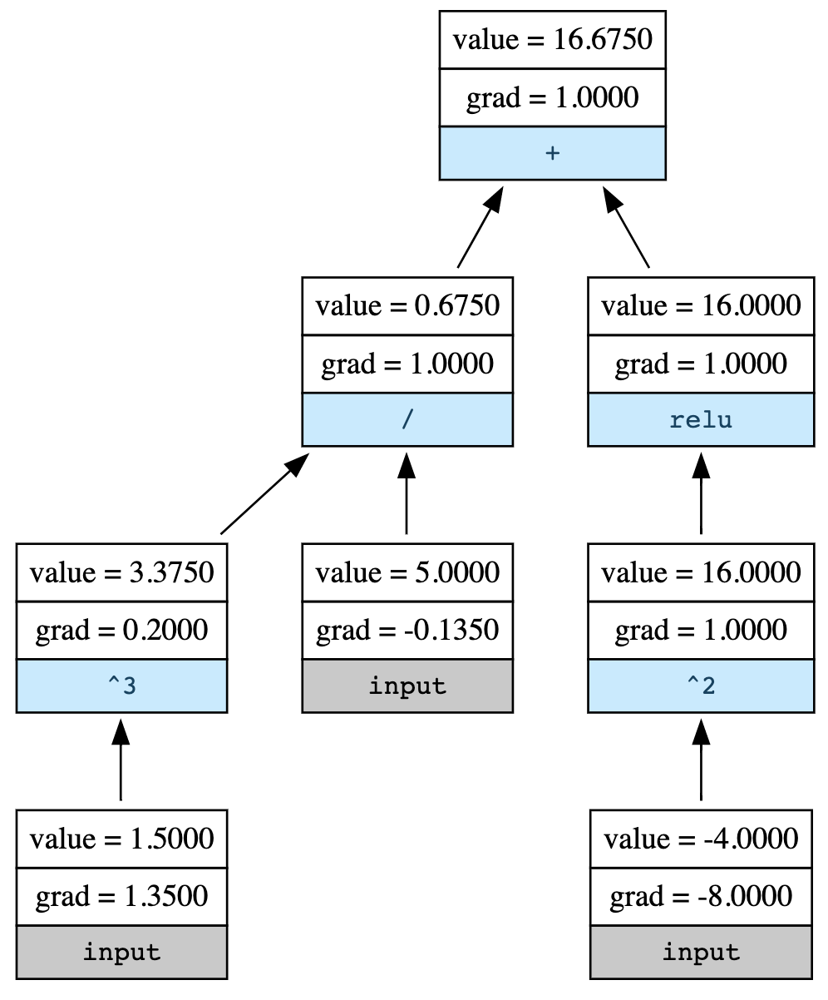

# MiniGrad

A minimal implementation of reverse-mode automatic differentiation (a.k.a. autograd) in pure Python.

Inspired by Andrej Karpathy's [micrograd](https://github.com/karpathy/micrograd), but with more comments and less cleverness. Thanks for the wonderful reference implementation and tests!

## Overview

Create a `Scalar`.

```python
a = Scalar(1.5)
```

Do some calculations.

```python
b = Scalar(-4.0)
c = a**3 / 5
d = c + (b**2).relu()
```

Compute the gradients.

```python
d.backward()
```

Plot the computational graph.

```python
draw_graph(d)
```



## Repo Structure

1. [`demo.ipynb`](demo.ipynb): Demo notebook of MiniGrad's functionality.
1. [`tests.ipynb`](tests.ipynb): Test notebook to verify gradients against [PyTorch](https://pytorch.org/) and [JAX](https://github.com/google/jax). Install both to run tests.
1. [`minigrad/minigrad.py`](minigrad/minigrad.py): The entire autograd logic in one (~100 loc) numeric class. See section below for details.
1. [`minigrad/visualize.py`](minigrad/visualize.py): This just draws nice-looking computational graphs. Install [Graphviz](https://graphviz.readthedocs.io/en/stable/manual.html) to run it.
1. [`requirements.txt`](requirements.txt): MiniGrad requires no external modules to run. This file just sets up my dev environment.

## Implementation

MiniGrad is implemented in one small (~100 loc) Python class, using no external modules. 

The entirety of the auto-differentiation logic lives in the `Scalar` class in [`minigrad.py`](minigrad/minigrad.py). 

A `Scalar` wraps a float/int and overrides its [arthimetic magic methods](https://docs.python.org/3/reference/datamodel.html#emulating-numeric-types) in order to:
1. Stitch together a define-by-run computational graph when doing arithmetic operations on a `Scalar`
1. Hard code the derivative functions of arithmetic operations
1. Keep track of `∂self/∂parent` between adjacent nodes
1. Compute `∂output/∂self` with the chain rule on demand (when `.backward()` is called)

This is called [reverse-mode automatic differentiation](https://en.wikipedia.org/wiki/Automatic_differentiation#Reverse_accumulation). It's great when you have few outputs and many inputs, since it computes all derivatives of one output in one pass. This is also how TensorFlow and PyTorch traditionally compute gradients.

(Forward-mode automatic differentiation also exists, and has the opposite advantage.)

## Not in Scope

This project is just for fun, so the following are not planned:

* Vectorization
* Higher order derivatives (i.e. `Scalar.grad` is a `Scalar` itself)
* Forward-mode automatic differentiation
* Neural network library on top of MiniGrad
